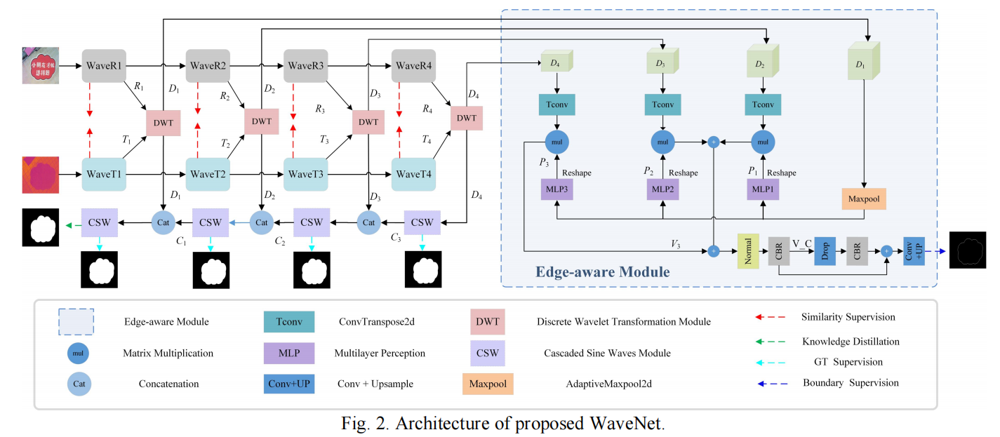
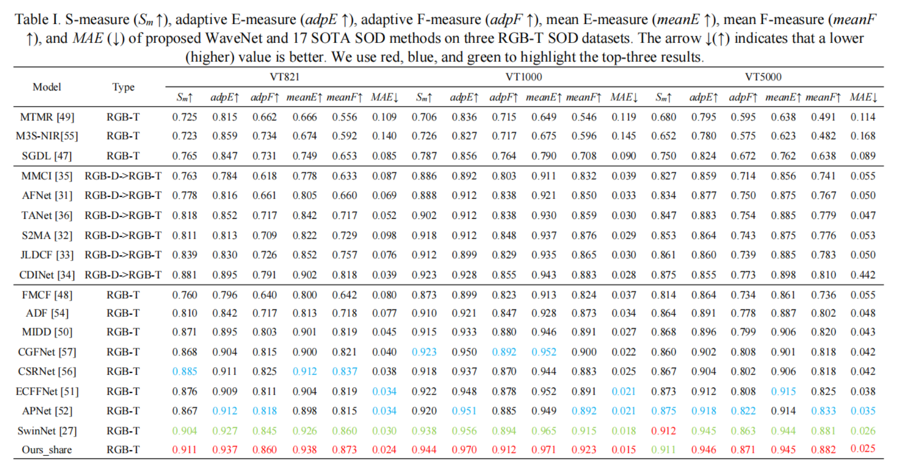

# WaveNet
This project provides the code and results for 'WaveNet: Wavelet Network With Knowledge Distillation for RGB-T Salient Object Detection', IEEE TIP, 2023. [IEEE link](https://ieeexplore.ieee.org/document/10127616)   

- Old codebase: https://github.com/nowander/WaveNet/tree/default
# Requirements
Python 3.7+, Pytorch 1.5.0+, Cuda 10.2+, TensorboardX 2.1, opencv-python, pytorch_wavelets, timm.  

# Architecture and Details

 

# Results

# Preparation
 - Download the RGB-T raw data from [LSNet](https://github.com/zyrant/LSNet).  
 - Options: Download the pre-trained wavemlp-s from [wavemlp](https://github.com/huawei-noah/Efficient-AI-Backbones/tree/master/wavemlp_pytorch).  
 - We have two ways of training knowledge distillation:
    1. Load the SwinNet model, please refer to the specific configuration of [SwinNet](https://github.com/liuzywen/SwinNet). 
    2. Directly load the prediction maps of SwinNet [baidu](https://pan.baidu.com/s/18qwaTwTZ39XtWlP3JaeSOQ) pin: py5y.  
We use prediction maps of SwinNet as the default setting.

# Training & Testing
Modify the `train_root` `train_root` `save_path` path in `config.py` according to your own data path.
- Train the WaveNet:

    `python train.py`
    
Modify the `test_path` path in `config.py` according to your own data path.

- Test the WaveNet:   

    `python test.py`

# Evaluate tools
- You can select one of the toolboxes to get the metrics
[CODToolbox](https://github.com/DengPingFan/CODToolbox)  / [PySODMetrics](https://github.com/lartpang/PySODMetrics)

# Saliency Maps
- RGB-T [baidu](https://pan.baidu.com/s/1i5GwM0C0OfE5D5VLXlBkVA) pin: gl01  

# Pretraining Models
- RGB-T [baidu](https://pan.baidu.com/s/1PGwu3uVRWyFS1erOBr7KAg) pin: v5pb  

# Citation
        @ARTICLE{10127616,
            author={Zhou, Wujie and Sun, Fan and Jiang, Qiuping and Cong, Runmin and Hwang, Jenq-Neng},
            journal={IEEE Transactions on Image Processing}, 
            title={WaveNet: Wavelet Network With Knowledge Distillation for RGB-T Salient Object Detection}, 
            year={2023},
            volume={32},
            number={},
            pages={3027-3039},
            doi={10.1109/TIP.2023.3275538}}     
                    
# Acknowledgement

The implementation of this project is based on the codebases below.  
- [BBS-Net](https://github.com/zyjwuyan/BBS-Net)  
- [LSNet](https://github.com/zyrant/LSNet)  
- [Wavemlp](https://github.com/huawei-noah/Efficient-AI-Backbones/tree/master/wavemlp_pytorch)  
- Evaluate tools [CODToolbox](https://github.com/DengPingFan/CODToolbox)  / [PySODMetrics](https://github.com/lartpang/PySODMetrics) 

If you find this project helpful, Please also cite the codebases above. Besides, we also thank [zyrant](https://github.com/zyrant).

# Contact
Please drop me an email for any problems or discussion: https://wujiezhou.github.io/ (wujiezhou@163.com).
